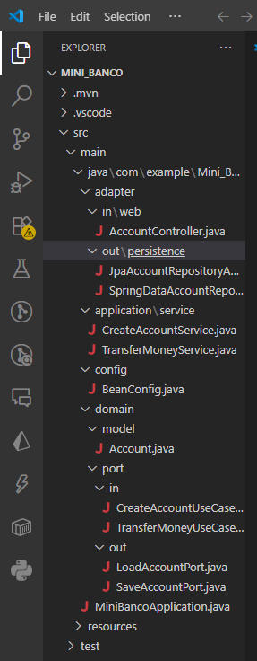
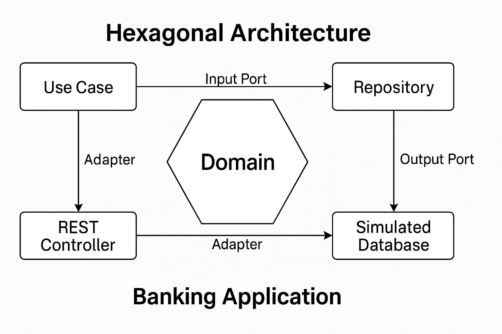

# 🏦 Proyecto Banco Hexagonal

Este proyecto es una simulación de un sistema bancario que implementa la **Arquitectura Hexagonal (Ports and Adapters)** usando **Spring Boot**. Permite crear cuentas y realizar transferencias entre ellas, separando la lógica del dominio de la infraestructura.

## 📦 Características

- Consulta de cuentas bancarias
- Transferencias entre cuentas
- Arquitectura desacoplada (hexagonal)
- Implementación simple en memoria (HashMap)

